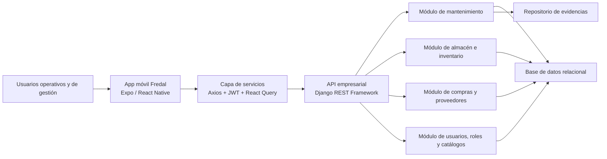
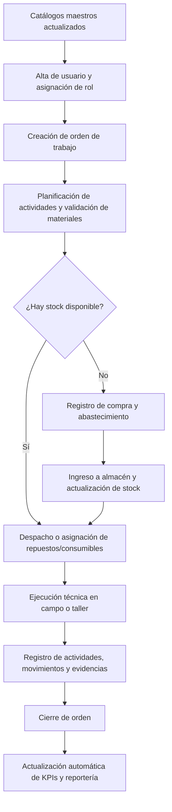

# Plataforma de Gestión Operativa Fredal

Solución empresarial de **Peruvian Group Fredal** orientada a centralizar la operación de mantenimiento, almacén y compras en una sola plataforma digital, con trazabilidad transaccional, control por roles y datos listos para la toma de decisiones.

La plataforma integra una **aplicación operativa móvil** para la ejecución en campo o taller y una **API backend** para gobierno de datos, reglas de negocio, seguridad y persistencia. Su propósito es reducir fricción operativa, eliminar reportería manual dispersa y convertir cada transacción del día a día en información accionable.

## Descripción General del Proyecto

La plataforma Fredal digitaliza el ciclo operativo completo de mantenimiento y abastecimiento:

- Crea y administra órdenes de trabajo para maquinaria.
- Asigna técnicos y controla el avance por estado, prioridad y ubicación.
- Registra actividades planificadas y ejecutadas con evidencia fotográfica.
- Gestiona repuestos unitarios y consumibles por lote, con historial de ubicación.
- Formaliza compras con proveedor, comprobante, moneda y tipo de cambio.
- Consolida datos operativos para indicadores de eficiencia, costo y disponibilidad.

En el estado actual del proyecto, el ecosistema se compone de:

| Componente | Implementación actual | Propósito |
| --- | --- | --- |
| Aplicación operativa | Expo + React Native | Ejecución móvil de órdenes, actividades, movimientos y cierre operativo |
| Capa de integración | Axios + JWT | Consumo seguro de servicios REST con renovación de token |
| Backend empresarial | Django + Django REST Framework | Reglas de negocio, seguridad, catálogos, auditoría y API |
| Persistencia | Django ORM sobre base relacional | Trazabilidad de mantenimiento, stock, compras y usuarios |
| Gestión de evidencias | `media/` local o Cloudinary en despliegue | Almacenamiento de imágenes de actividades |

## Objetivos de Negocio

- **Reducir tiempos de reportería** convirtiendo la operación diaria en datos estructurados, en lugar de depender de hojas de cálculo manuales.
- **Aumentar la trazabilidad de mantenimiento** con control de órdenes, actividades, evidencias y responsables por intervención.
- **Controlar inventario en contexto operativo** identificando dónde se encuentra cada repuesto o consumible: almacén, maquinaria o técnico.
- **Mejorar la planificación de abastecimiento** con historial de compras, proveedores, precios promedio, moneda y tipo de cambio.
- **Elevar la disponibilidad de equipos** al conectar mantenimiento, stock y compras dentro del mismo flujo de trabajo.
- **Soportar decisiones gerenciales con KPIs confiables** sobre backlog, urgencias, consumo, costo por maquinaria y desempeño operativo.

## Funcionalidades Principales

| Dominio | Funcionalidad | Valor para el negocio |
| --- | --- | --- |
| Mantenimiento | Creación de órdenes de trabajo con código correlativo, prioridad, lugar, estado del equipo y técnicos asignados | Estandariza la ejecución y priorización de intervenciones |
| Ejecución | Registro de actividades por orden, tipo de actividad, tipo de mantenimiento y subtipo | Homologa criterios técnicos y facilita análisis posterior |
| Evidencias | Carga de imágenes por actividad realizada | Sustenta cierres y auditoría operacional |
| Almacén | Gestión de repuestos unitarios con serie única y consumibles por lote | Permite trazabilidad real del inventario |
| Movimientos | Cambio de ubicación entre almacén, maquinaria y trabajador | Da visibilidad al ciclo de vida del material |
| Compras | Registro de compras por proveedor, comprobante, moneda, IGV y detalle por item | Formaliza abastecimiento y costeo |
| Catálogos | Gestión de maquinaria, trabajadores, almacenes, clientes, ubicaciones, dimensiones y unidades de medida | Reduce errores por catálogos inconsistentes |
| Seguridad | Acceso por roles, permisos granulares y vistas filtradas por usuario | Protege datos y limita acciones por responsabilidad |
| Analítica operativa | Dashboard de órdenes y base estructurada para KPIs | Acelera monitoreo y toma de decisiones |

## Arquitectura General

La arquitectura sigue una separación clara entre experiencia operativa, servicios de negocio y persistencia:

### Vista de alto nivel por capas

| Capa | Responsabilidad | Tecnología actual |
| --- | --- | --- |
| Presentación | Interfaz móvil para ejecución de tareas, consulta de órdenes y carga de evidencia | Expo Router, React Native |
| Estado y consumo de datos | Cache, sincronización y sesión del usuario | React Query, Zustand, SecureStore |
| API y seguridad | Exposición de endpoints, autenticación y autorización | Django REST Framework, SimpleJWT |
| Dominio | Reglas de negocio de OT, actividades, stock, compras, catálogos y usuarios | Modelos y viewsets Django |
| Persistencia | Almacenamiento transaccional y relacional | SQLite en desarrollo, compatible con PostgreSQL para producción |
| Archivos | Gestión de imágenes de evidencia | FileSystem local o Cloudinary |

### Principios de diseño aplicados

- **Trazabilidad primero**: cada orden, actividad, movimiento o compra queda asociada a fecha, usuario, entidad y contexto operativo.
- **Mínimo privilegio**: la API valida autenticación y permisos antes de permitir operaciones sensibles.
- **Movilidad operativa**: el frontend prioriza velocidad de captura en campo y consulta rápida del estado de órdenes.
- **Modelo de datos unificado**: mantenimiento, almacén y compras comparten entidades maestras y relaciones explícitas.

## Gestión de Usuarios y Seguridad

La plataforma utiliza autenticación basada en **JWT Bearer Token**, con renovación de token (`refresh token`) y almacenamiento seguro de credenciales en dispositivo móvil mediante **SecureStore**. La autorización se resuelve por **grupos/roles** en backend, aplicando permisos por módulo y por operación.

### Sistema de roles y permisos

| Rol | Alcance principal | Permisos relevantes |
| --- | --- | --- |
| Administrador | Gobierno integral de la plataforma | Acceso total a usuarios, roles, catálogos, mantenimiento, stock, compras y configuración |
| Jefe de Técnicos | Coordinación de mantenimiento | Crea y gestiona órdenes de trabajo, supervisa ejecución y asigna personal técnico |
| Técnico | Ejecución operativa | Visualiza solo órdenes asignadas, actualiza avance, registra actividades y adjunta evidencias |
| Jefe de Almaceneros | Gobierno de materiales y soporte operativo | Gestiona items, coordina actividades planificadas y habilita disponibilidad de materiales |
| Almacenero | Operación de almacén | Registra movimientos de repuestos/consumibles y participa en la preparación operativa del trabajo |
| ManageCompras | Gestión de abastecimiento | Administra compras y tipos de cambio; consulta items para abastecimiento |
| Analista o Gerencia | Consumo de información | Acceso recomendado en modo lectura para dashboards y reportería ejecutiva |

### Reglas de seguridad relevantes

- Todas las rutas de API son autenticadas por defecto.
- El backend distingue permisos por módulo: trabajo, stock/items, compras, catálogos y movimientos.
- Los técnicos no operan sobre cualquier orden: solo sobre aquellas en las que fueron asignados.
- Las actividades planificadas tienen un control específico para perfiles de almacén y administración.
- Los tokens de acceso son temporales y se renuevan con `refresh token`, reduciendo exposición de sesión.
- El alta de usuarios operativos puede realizarse mediante **códigos de registro temporales**, con expiración y uso único.
- Las evidencias fotográficas quedan asociadas a la actividad correspondiente, reforzando auditoría y validación posterior.
- Existe una entidad de auditoría para registrar acciones sobre objetos clave del sistema.

## Módulos del Sistema

| Módulo | Entidades clave | Descripción funcional |
| --- | --- | --- |
| Mantenimiento | `OrdenTrabajo`, `ActividadTrabajo`, `TecnicoAsignado` | Gestiona el ciclo de vida de la intervención: creación, asignación, ejecución y cierre |
| Evidencias de campo | `ActividadTrabajoEvidencia` | Adjunta soporte visual a las actividades ejecutadas |
| Inventario de repuestos | `Item`, `ItemUnidad`, `HistorialUbicacionItem` | Controla repuestos unitarios con serie, estado y ubicación actual |
| Inventario de consumibles | `LoteConsumible`, `HistorialConsumible`, `MovimientoConsumible` | Controla consumo por cantidad, lote y destino operativo |
| Movimientos operativos | `MovimientoRepuesto`, `MovimientoConsumible`, `TraspasoItem` | Registra salidas, asignaciones y cambios de ubicación |
| Compras y abastecimiento | `Compra`, `CompraDetalle`, `Proveedor`, `ItemProveedor`, `TipoCambioDiario` | Formaliza adquisiciones, precios, monedas y proveedores |
| Catálogos maestros | `Maquinaria`, `Trabajador`, `Almacen`, `Cliente`, `UbicacionCliente`, `Dimension`, `UnidadMedida`, `UnidadRelacion`, `ItemGrupo` | Estandariza datos de referencia y evita inconsistencias |
| Usuarios y perfiles | `User`, `PerfilUsuario`, `CodigoRegistro` | Administra acceso, relación con trabajador y procesos de incorporación |
| Analítica operativa | KPIs derivados de OT, actividades, movimientos y compras | Convierte la operación diaria en información de gestión |

## Indicadores (KPIs)

Los KPIs deben mostrarse según responsabilidad operativa y nivel de decisión. La lógica recomendada es que el usuario vea primero lo que necesita accionar, no todo el universo de datos.

| Rol | KPIs visibles | Decisiones que habilita |
| --- | --- | --- |
| Administrador | OT totales por estado, OT urgentes, tiempo promedio de cierre, cumplimiento de SLA, costo por maquinaria, gasto por proveedor, rotación de inventario, incidencias de auditoría | Priorización global, reasignación de recursos, control de costo y gobierno del sistema |
| Jefe de Técnicos | OT pendientes, en proceso y cerradas; carga por técnico; porcentaje de actividades con evidencia; ratio preventivo/correctivo; tiempo medio por tipo de mantenimiento | Balanceo de carga, seguimiento de ejecución y control de productividad |
| Técnico | OT asignadas, actividades pendientes, actividades completadas, tiempo invertido por orden, materiales consumidos por orden, porcentaje de órdenes cerradas correctamente | Ejecución diaria, priorización personal y cierre de trabajos con evidencia completa |
| Jefe de Almaceneros | Stock disponible por almacén, items críticos, materiales asignados a órdenes, materiales en campo, items inoperativos o reparados, nivel de cobertura por actividad planificada | Planeamiento logístico, reaprovisionamiento y control de disponibilidad |
| Almacenero | Despachos del día, movimientos pendientes, consumo por orden, lotes disponibles, repuestos asignados por técnico, devoluciones o cambios de estado | Preparación operativa y control de despacho/retorno |
| ManageCompras | Volumen de compras por proveedor, precio promedio por item, compras por moneda, impacto del tipo de cambio, lead time compra-ingreso, frecuencia de compra por item | Negociación con proveedores, consolidación de compras y control de abastecimiento |
| Analista o Gerencia | Backlog total, tendencia mensual de mantenimiento, costo por línea de equipo, top máquinas con mayor intervención, consumo por centro de costo, tiempo ahorrado en reportería | Decisiones tácticas y estratégicas basadas en datos consolidados |

### KPIs operativos mínimos recomendados en la primera versión ejecutiva

| KPI | Fórmula sugerida | Fuente principal |
| --- | --- | --- |
| Backlog de OT | Órdenes en `PENDIENTE` + `EN_PROCESO` | `OrdenTrabajo` |
| Tasa de urgencia | OT urgentes / OT totales del período | `OrdenTrabajo.prioridad` |
| Tiempo promedio de cierre | Fecha/hora de fin - fecha/hora de inicio | `OrdenTrabajo` |
| Cumplimiento de evidencia | Actividades con imagen / actividades ejecutadas | `ActividadTrabajo` + `ActividadTrabajoEvidencia` |
| Consumo por OT | Suma de repuestos y consumibles asociados | `MovimientoRepuesto` + `MovimientoConsumible` |
| Cobertura de stock | Stock disponible / demanda planificada | `Item`, `LoteConsumible`, actividades planificadas |
| Costo por maquinaria | Valor de materiales activos o consumidos por equipo | `Maquinaria`, historiales, compras |
| Precio promedio por proveedor | Promedio de `valor_unitario` por item y proveedor | `CompraDetalle`, `Proveedor` |

## Workflows del Sistema

### 1. Workflow de solicitud y ejecución de mantenimiento

1. Un usuario operativo detecta una incidencia o identifica una necesidad de mantenimiento preventivo.
2. El **Jefe de Técnicos** o un **Administrador** crea la orden de trabajo con maquinaria, prioridad, lugar, ubicación exacta y personal asignado.
3. El sistema genera un código único de orden, por ejemplo: `OT-2026-00015`.
4. La orden nace en estado `PENDIENTE` y queda visible en el tablero operativo.
5. Si el trabajo requiere preparación logística, el equipo de almacén registra actividades planificadas y valida disponibilidad de materiales.
6. Cuando la intervención inicia, la orden pasa a `EN_PROCESO`.
7. El **Técnico** registra actividades ejecutadas indicando tipo de actividad, tipo de mantenimiento y subtipo técnico.
8. El técnico adjunta evidencias fotográficas y registra consumo o cambio de materiales utilizados en la intervención.
9. El supervisor valida que el trabajo esté completo, con actividades, materiales y evidencia consistentes.
10. La orden se cierra en estado `FINALIZADO`, bloqueando nuevas capturas operativas para preservar integridad del cierre.

### 2. Workflow de preparación y despacho de materiales

1. La orden o actividad identifica repuestos y consumibles requeridos.
2. El módulo de items consulta disponibilidad real por tipo de insumo.
3. Para repuestos unitarios, se seleccionan unidades específicas con serie única.
4. Para consumibles, se calcula disponibilidad por lote y unidad de medida.
5. El **Almacenero** registra el movimiento del material hacia técnico, maquinaria o almacén destino.
6. El historial activo de ubicación se cierra y se crea un nuevo historial, dejando trazabilidad completa del cambio.
7. Si un repuesto cambia de estado a usado, reparado o inoperativo, el sistema actualiza su condición y su ubicación.
8. La orden queda asociada al consumo real, habilitando costeo y trazabilidad posterior.

### 3. Workflow de compras y abastecimiento

1. El equipo de almacén o gestión detecta necesidad de reposición por quiebre, baja cobertura o demanda operativa.
2. El usuario **ManageCompras** revisa proveedor, moneda y precio histórico por item.
3. Se registra la compra con tipo de comprobante, código de comprobante, proveedor y fecha.
4. Cada detalle de compra incorpora item, cantidad, unidad de medida, moneda y valor unitario.
5. Para repuestos, el sistema puede generar unidades trazables por serie.
6. Para consumibles, crea lotes con cantidad inicial, cantidad disponible y almacén de ingreso.
7. Si la compra está en USD o EUR, el análisis se apoya en tipo de cambio diario.
8. El stock queda actualizado y disponible para futuras órdenes de trabajo.

### 4. Workflow de incorporación de usuarios operativos

1. Administración crea o valida el registro del trabajador.
2. Se emite un código de registro temporal y de un solo uso.
3. El trabajador se registra en la plataforma usando ese código.
4. El sistema vincula el usuario digital con el trabajador físico y su rol de operación.
5. Desde ese momento, la visibilidad y acciones quedan condicionadas por su grupo de permisos.

## Flujo Completo del Sistema (end-to-end)

El siguiente flujo resume cómo la plataforma conecta mantenimiento, almacén, compras y analítica en una sola cadena operativa:

### Narrativa end-to-end

1. El proceso inicia con catálogos maestros confiables: maquinaria, trabajadores, items, proveedores, almacenes y unidades de medida.
2. Cada usuario entra al sistema con un rol definido, lo que determina qué información ve y qué puede modificar.
3. Se crea la orden de trabajo y se asignan responsables.
4. La necesidad de materiales se contrasta con stock real y ubicación actual.
5. Si hay disponibilidad, el material se despacha y queda trazado contra la orden.
6. Si no hay disponibilidad, compras registra el abastecimiento y actualiza el inventario una vez ingresado.
7. El técnico ejecuta, registra actividades, evidencia y consumo real.
8. Al cerrar la orden, la plataforma consolida automáticamente datos para KPIs de operación, costo, abastecimiento y productividad.

## Beneficios de la Plataforma

- **Visibilidad operativa en tiempo real** sobre órdenes, actividades, materiales y responsables.
- **Menor dependencia de Excel y reportería manual**, reduciendo tiempo administrativo y riesgo de inconsistencia.
- **Trazabilidad integral del inventario**, desde la compra hasta el uso en maquinaria o asignación a técnico.
- **Mejor control del costo operativo**, gracias a la relación entre compras, tipo de cambio, consumo y maquinaria.
- **Mayor disciplina de ejecución**, al exigir actividades estructuradas, evidencia y cierre controlado.
- **Escalabilidad tecnológica**, al separar frontend móvil, API y persistencia empresarial.
- **Base sólida para analítica y gobierno de datos**, con entidades normalizadas y eventos transaccionales reutilizables para dashboards ejecutivos.

## Cierre

La plataforma Fredal no es solo un sistema transaccional; es una capa de control operativo y analítico para **Peruvian Group Fredal**. Su valor diferencial está en conectar mantenimiento, almacén y compras dentro de un mismo flujo digital, de modo que cada acción operativa alimente decisiones más rápidas, trazables y sostenibles para la organización.
