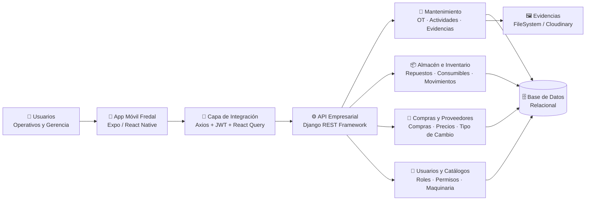
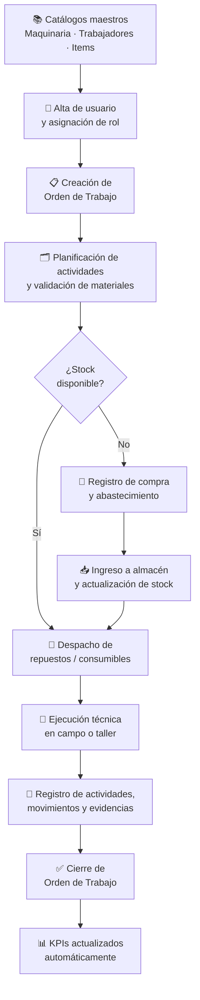

<div align="center">

<br/>

```
███████╗██████╗ ███████╗██████╗  █████╗ ██╗
██╔════╝██╔══██╗██╔════╝██╔══██╗██╔══██╗██║
█████╗  ██████╔╝█████╗  ██║  ██║███████║██║
██╔══╝  ██╔══██╗██╔══╝  ██║  ██║██╔══██║██║
██║     ██║  ██║███████╗██████╔╝██║  ██║███████╗
╚═╝     ╚═╝  ╚═╝╚══════╝╚═════╝ ╚═╝  ╚═╝╚══════╝
```

### Plataforma de Gestión Operativa
**Peruvian Group Fredal**

*Mantenimiento · Almacén · Compras — en un solo flujo digital*

<br/>

[](https://expo.dev)
[](https://www.django-rest-framework.org)
[](https://jwt.io)
[]()

</div>

---

## ¿Qué es Fredal?

> **Fredal** convierte cada acción operativa del día a día — una orden de trabajo, un despacho de repuesto, una compra — en información estructurada y accionable. Deja de buscar datos en hojas de cálculo dispersas y empieza a tomar decisiones sobre datos reales.

La plataforma digitaliza el ciclo completo de **mantenimiento, almacén y compras** en una sola cadena operativa, conectando a técnicos en campo, almaceneros, jefes de área y gerencia dentro del mismo ecosistema de datos.

---

## El Problema que Resuelve

```
ANTES  ─────────────────────────────────────────────────────────────────
  📋 Órdenes de trabajo en papel o Excel sin trazabilidad
  🔍 Inventario desconocido: "¿Dónde está ese repuesto?"
  💸 Compras sin historial de precios, proveedor ni tipo de cambio
  📊 Reportería manual que tarda días y pierde vigencia
  🔗 Mantenimiento, almacén y compras operando en silos

DESPUÉS ─────────────────────────────────────────────────────────────────
  ✅ Órdenes con código único, estado, prioridad, técnico y evidencia
  ✅ Cada repuesto trazado desde la compra hasta su uso en maquinaria
  ✅ Compras formalizadas con proveedor, moneda y tipo de cambio diario
  ✅ KPIs operativos actualizados en tiempo real sin trabajo manual
  ✅ Un solo flujo digital que conecta toda la operación
```

---

## Arquitectura del Sistema



### Stack Tecnológico

| Capa | Tecnología | Responsabilidad |
|------|-----------|----------------|
| 📱 **Presentación** | Expo Router + React Native | Interfaz móvil para campo y taller |
| 🔄 **Estado y Datos** | React Query + Zustand + SecureStore | Cache, sincronización y sesión |
| 🔐 **API y Seguridad** | Django REST Framework + SimpleJWT | Endpoints, autenticación y autorización |
| 🏗️ **Dominio** | Modelos y ViewSets Django | Reglas de negocio de todos los módulos |
| 🗄️ **Persistencia** | SQLite → PostgreSQL (producción) | Almacenamiento transaccional y relacional |
| 🖼️ **Archivos** | FileSystem local / Cloudinary | Gestión de imágenes de evidencia |

---

## Flujo Operativo End-to-End

> Así conecta Fredal cada pieza de la operación en una sola cadena de valor:



---

## Módulos del Sistema

<details>
<summary><strong>🔧 Módulo de Mantenimiento</strong></summary>
<br/>

Gestiona el ciclo de vida completo de cada intervención técnica.

**Entidades clave:** `OrdenTrabajo` · `ActividadTrabajo` · `TecnicoAsignado` · `ActividadTrabajoEvidencia`

**Flujo:**
1. Jefe de Técnicos crea la OT con maquinaria, prioridad y personal asignado
2. El sistema genera código único correlativo (`OT-2026-00015`)
3. La orden nace en `PENDIENTE` y es visible en el tablero operativo
4. Al iniciar, pasa a `EN_PROCESO`
5. El técnico registra actividades, consumo y evidencias fotográficas
6. Supervisor valida consistencia y cierra en `FINALIZADO`

**Estados de OT:** `PENDIENTE` → `EN_PROCESO` → `FINALIZADO`

</details>

<details>
<summary><strong>📦 Módulo de Almacén e Inventario</strong></summary>
<br/>

Control de dos tipos de material con trazabilidad distinta:

| Tipo | Modelo | Trazabilidad |
|------|--------|-------------|
| **Repuestos unitarios** | `Item` + `ItemUnidad` | Por número de serie único |
| **Consumibles** | `LoteConsumible` | Por cantidad y lote |

**Movimientos registrados:** Almacén → Técnico · Almacén → Maquinaria · Devolución · Cambio de estado (usado / reparado / inoperativo)

Cada movimiento cierra el historial de ubicación anterior y abre uno nuevo, garantizando trazabilidad completa.

</details>

<details>
<summary><strong>🛒 Módulo de Compras y Abastecimiento</strong></summary>
<br/>

Formaliza el proceso de adquisición con soporte multidivisa.

**Entidades clave:** `Compra` · `CompraDetalle` · `Proveedor` · `ItemProveedor` · `TipoCambioDiario`

**Flujo:**
1. Detección de necesidad por quiebre de stock o baja cobertura
2. Revisión de proveedor, moneda y precio histórico
3. Registro de compra con tipo de comprobante, código y fecha
4. Detalle por ítem: cantidad, unidad, moneda y valor unitario
5. Generación automática de unidades trazables (repuestos) o lotes (consumibles)
6. Stock actualizado y disponible para nuevas órdenes

**Monedas soportadas:** PEN · USD · EUR (con tipo de cambio diario)

</details>

<details>
<summary><strong>👥 Módulo de Usuarios, Roles y Catálogos</strong></summary>
<br/>

Gobierno de acceso y datos maestros del sistema.

**Catálogos:** `Maquinaria` · `Trabajador` · `Almacen` · `Cliente` · `UbicacionCliente` · `Dimension` · `UnidadMedida` · `ItemGrupo`

**Incorporación de usuarios:**
1. Admin crea/valida el registro del trabajador
2. Se emite código de registro temporal y de un solo uso
3. El trabajador se registra usando ese código
4. El sistema vincula usuario digital ↔ trabajador físico ↔ rol

</details>

---

## Sistema de Roles y Permisos

```
┌─────────────────────────────────────────────────────────────────────┐
│  NIVELES DE ACCESO                                                  │
├─────────────────┬───────────────────────────────────────────────────┤
│ 👑 Administrador │ Acceso total · Gobierno integral de la plataforma │
├─────────────────┼───────────────────────────────────────────────────┤
│ 👔 Jefe Técnicos │ Crea OT · Supervisa ejecución · Asigna personal   │
├─────────────────┼───────────────────────────────────────────────────┤
│ 🔧 Técnico       │ Solo OT asignadas · Actividades · Evidencias       │
├─────────────────┼───────────────────────────────────────────────────┤
│ 📦 Jefe Almacén  │ Items · Actividades planificadas · Disponibilidad  │
├─────────────────┼───────────────────────────────────────────────────┤
│ 🏭 Almacenero    │ Movimientos · Despacho · Lotes disponibles         │
├─────────────────┼───────────────────────────────────────────────────┤
│ 🛒 ManageCompras │ Compras · Proveedores · Tipo de cambio             │
├─────────────────┼───────────────────────────────────────────────────┤
│ 📊 Gerencia      │ Lectura completa · Dashboards · KPIs ejecutivos    │
└─────────────────┴───────────────────────────────────────────────────┘
```

**Principios de seguridad:**
- 🔒 Todas las rutas de API son autenticadas por defecto
- 🎯 Mínimo privilegio: cada rol solo accede a lo que necesita operar
- ⏱️ Tokens temporales con renovación automática via `refresh token`
- 📸 Evidencias asociadas a actividad para auditoría y validación posterior
- 🔑 Registro por código temporal de uso único con expiración

---

## KPIs Operativos

> El sistema convierte cada transacción en un dato de gestión. Los KPIs se muestran según el rol para que cada usuario vea lo que necesita accionar, no el universo completo de datos.

| KPI | Fórmula | Fuente |
|-----|---------|--------|
| **Backlog de OT** | OT en `PENDIENTE` + `EN_PROCESO` | `OrdenTrabajo` |
| **Tasa de urgencia** | OT urgentes / OT totales del período | `OrdenTrabajo.prioridad` |
| **Tiempo promedio de cierre** | Fecha fin − Fecha inicio | `OrdenTrabajo` |
| **Cumplimiento de evidencia** | Actividades con imagen / actividades ejecutadas | `ActividadTrabajo` + Evidencias |
| **Consumo por OT** | Σ repuestos + consumibles asociados | `MovimientoRepuesto` + `MovimientoConsumible` |
| **Cobertura de stock** | Stock disponible / demanda planificada | `Item` + `LoteConsumible` |
| **Costo por maquinaria** | Valor de materiales consumidos por equipo | `Maquinaria` + historiales + compras |
| **Precio promedio por proveedor** | Promedio de `valor_unitario` por item y proveedor | `CompraDetalle` + `Proveedor` |

---

## Principios de Diseño

La plataforma está construida sobre cuatro pilares de ingeniería operativa:

```
  📍 TRAZABILIDAD PRIMERO
     Cada OT, actividad, movimiento o compra queda asociada a fecha,
     usuario, entidad y contexto operativo. Sin excepción.

  🔐 MÍNIMO PRIVILEGIO
     La API valida autenticación y permisos antes de permitir
     cualquier operación sensible. El rol define la visibilidad.

  📱 MOVILIDAD OPERATIVA
     El frontend prioriza velocidad de captura en campo y consulta
     rápida del estado de órdenes desde cualquier dispositivo.

  🔗 MODELO DE DATOS UNIFICADO
     Mantenimiento, almacén y compras comparten entidades maestras
     y relaciones explícitas. Un solo origen de verdad.
```

---

## Beneficios Clave

| Área | Antes | Con Fredal |
|------|-------|-----------|
| **Reportería** | Excel manual, días de retraso | KPIs en tiempo real, sin trabajo adicional |
| **Inventario** | "Hay que ir a ver físicamente" | Ubicación exacta de cada repuesto en el sistema |
| **Mantenimiento** | Órdenes en papel, sin evidencia | OT estructuradas con evidencia fotográfica auditada |
| **Compras** | Sin historial de precios ni proveedores | Historial completo con moneda y tipo de cambio |
| **Decisiones** | Basadas en intuición o datos tardíos | Basadas en datos operativos actualizados |

---

## Estructura del Proyecto

```
fredal/
├── 📱 mobile/                  # Aplicación Expo + React Native
│   ├── app/                   # Expo Router (pantallas y navegación)
│   ├── components/            # Componentes reutilizables
│   ├── services/              # Axios + integración con API
│   └── store/                 # Estado global con Zustand
│
└── ⚙️ backend/                 # API Django REST Framework
    ├── mantenimiento/         # OT, actividades, evidencias
    ├── almacen/               # Items, lotes, movimientos
    ├── compras/               # Compras, proveedores, tipo de cambio
    ├── usuarios/              # Auth, roles, perfiles, códigos de registro
    └── catalogos/             # Maquinaria, trabajadores, almacenes, etc.
```

---

## Estado del Proyecto

| Componente | Estado |
|-----------|--------|
| 📱 App Móvil (Expo + React Native) | 🟢 En desarrollo activo |
| ⚙️ API Backend (Django REST Framework) | 🟢 En desarrollo activo |
| 🔐 Auth JWT + Roles y Permisos | 🟢 Implementado |
| 🔧 Módulo de Mantenimiento | 🟢 Implementado |
| 📦 Módulo de Almacén e Inventario | 🟢 Implementado |
| 🛒 Módulo de Compras | 🟢 Implementado |
| 📊 Dashboard y KPIs | 🟡 En progreso |
| ☁️ Despliegue en producción | 🔵 Planificado |

---

<div align="center">

**Peruvian Group Fredal**

*Una plataforma construida para que la operación diaria alimente decisiones más rápidas, trazables y sostenibles.*

---

`Mantenimiento` · `Almacén` · `Compras` · `Trazabilidad` · `Mejora Continua`

</div>