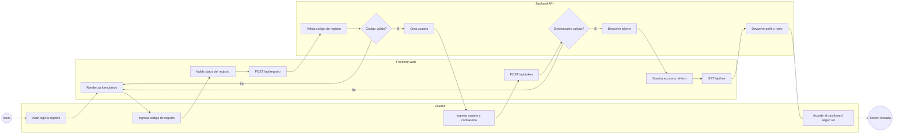
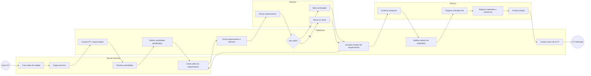
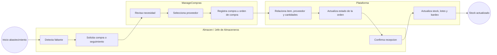

# Fredal Workspace Web

This is the web frontend for the Fredal operational platform. It is built with [Next.js](https://nextjs.org) and connects to the backend API exposed by the maintenance, warehouse, purchasing, and analytics services in the `core/` project.

## Getting Started

First, make sure you have the backend running and create the local environment file from the committed template:

```bash
cp .env.example .env.local
```

The default local API URL is:

```bash
NEXT_PUBLIC_API_URL=http://localhost:8000
```

Then install dependencies and run the development server:

```bash
npm install
npm run dev
```

Open [http://localhost:3000](http://localhost:3000) with your browser to see the result.

You can start editing the application by modifying the App Router pages in `src/app/`. The login entry point lives in `src/app/page.jsx`, and the authenticated modules live under `src/app/(private)/`.

This project uses Next.js App Router, Tailwind CSS 4, shared UI primitives, JWT-based authentication, and role-aware navigation for the Fredal workspace.

Useful scripts:

```bash
npm run dev
npm run build
npm run start
npm run lint
```

Main areas of the codebase:

```text
src/
  app/                  App Router pages and private modules
  components/           Domain components and shared UI
  config/               Navigation and permission metadata
  context/              Auth provider and session state
  lib/                  API clients, constants, and utilities
  middleware.js         Route protection and public asset passthrough
public/
  logo/                 Brand assets used by auth and layout screens
```

## Learn More

### Project Scope

Fredal Workspace centralizes the operational flow for:

- authentication and role-aware access
- work order planning, execution, and closure
- requirement orders and warehouse confirmation flows
- purchasing and supplier management
- clients, units, machinery, and master data administration
- management dashboards and analytic modules
- catalog import and export for admin users

### Main Modules

| Module | Route | Typical roles | Purpose |
| --- | --- | --- | --- |
| Dashboard | `/dashboard` | Tecnico, Jefe de Tecnicos, Almacenero, Jefe de Almaceneros, ManageCompras, admin | Entry point with role-aware operational context |
| Trabajos | `/trabajos` | Tecnico, Jefe de Tecnicos, Almacenero, Jefe de Almaceneros, ManageCompras, admin | Work orders, planned activities, execution, materials, and finalization |
| Compras | `/compras` | ManageCompras, admin, Jefe de Almaceneros, Almacenero | Purchasing records and order tracking |
| Almacen | `/almacen` | Almacenero, Jefe de Almaceneros, admin | Inventory review, stock actions, and warehouse operations |
| Proveedores | `/proveedores` | ManageCompras, admin | Supplier management |
| Clientes | `/clientes` | admin, Jefe de Tecnicos, ManageCompras | Client and location administration |
| Unidades | `/unidades` | admin, Almacenero, Jefe de Almaceneros, ManageCompras | Unit, dimension, and relation catalogs |
| Maquinaria | `/maquinaria` | admin, Jefe de Tecnicos, Jefe de Almaceneros, ManageCompras | Machinery catalog and historical context |
| Gestion | `/gestion` | admin, Jefe de Tecnicos, Jefe de Almaceneros, ManageCompras | Management analytics and decision-support visualizations |
| Catalogo Sync | `/catalogo-sync` | admin | Import/export tooling |
| Trabajadores | `/trabajadores` | admin | Worker administration |
| Usuarios | `/usuarios` | admin | User and permission administration |

### Technical Flow

The application uses:

- `src/context/AuthContext.jsx` to load the active user and expose auth state to the app
- `src/lib/api.js` for Axios clients, JWT refresh, and domain API wrappers
- `src/config/menu.js` to define module visibility by role
- `src/middleware.js` to protect private routes while allowing public pages and static assets
- `src/components/` to implement each domain workflow with reusable UI primitives

Authentication and backend integration are based on:

- `POST /api/token/` for login
- `POST /api/token/refresh/` for access token renewal
- `GET /api/me/` for session bootstrap
- domain endpoints such as `/api/trabajos/`, `/api/actividades/`, `/api/items/`, `/api/ordenes-requerimiento/`, and `/api/ordenes-compra/`

### BPMN Workflows

Below are BPMN-style diagrams rendered with Mermaid to document the main workflows covered by the project.

#### BPMN - User Registration and Login



#### BPMN - Work Order, Requirement Order, and Execution



#### BPMN - Purchasing and Inventory Replenishment



### Recommended Reading Inside the Project

To understand the project faster, review these files:

- `src/app/page.jsx` and `src/app/register/page.jsx` for the public auth flow
- `src/context/AuthContext.jsx` for session loading and login bootstrap
- `src/lib/api.js` for backend integration and token refresh
- `src/config/menu.js` for role-based module visibility
- `src/app/(private)/trabajos/` for the main operational workflow
- `src/app/(private)/gestion/` for analytics and management views

## Deploy on Vercel

The simplest deployment target for this frontend is [Vercel](https://vercel.com/).

Before deploying, configure at least:

```bash
NEXT_PUBLIC_API_URL=https://your-backend-domain.com
```

Recommended deployment checklist:

1. Connect the `my-app/` project to Vercel.
2. Add `NEXT_PUBLIC_API_URL` in the Vercel environment variables.
3. Make sure the backend allows the deployed frontend origin through CORS.
4. Run `npm run build` locally to validate the production bundle.
5. Deploy and verify login, role redirects, and the main API-backed modules.

If you deploy outside Vercel, the same production requirement still applies: the frontend must be able to reach the backend API and preserve the auth flow based on tokens and protected routes.
